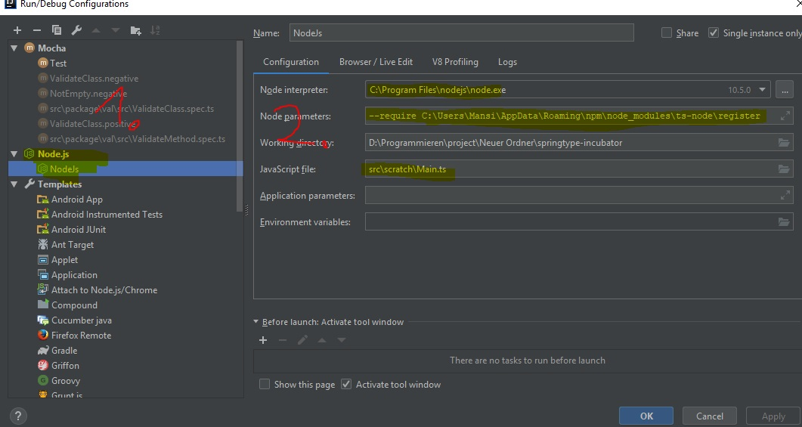

# Usage
    npm i
    ts-node src/scratch/Main.ts
    
## Example Intellij

    npm i
    npm i -g ts-node typescript    
    1. Add a new configuration for Node.js
    2. Add to Node parameters "--require C:\Users\CHANGE_ME\AppData\Roaming\npm\node_modules\ts-node\register"
    3. In JavaScript file "src\scratch\Main.ts"
    4. Save configuration and use all debugging features
    

    
### Executing test
    1. Add a new configuration for Mocha
    2. Add your Node Interpreter path to node module
    3. Add to Node options "--require C:\Users\CHANGE_ME\AppData\Roaming\npm\node_modules\ts-node\register"
    4. Select file pattern and enter this "src/**/*.spec.ts"
    

