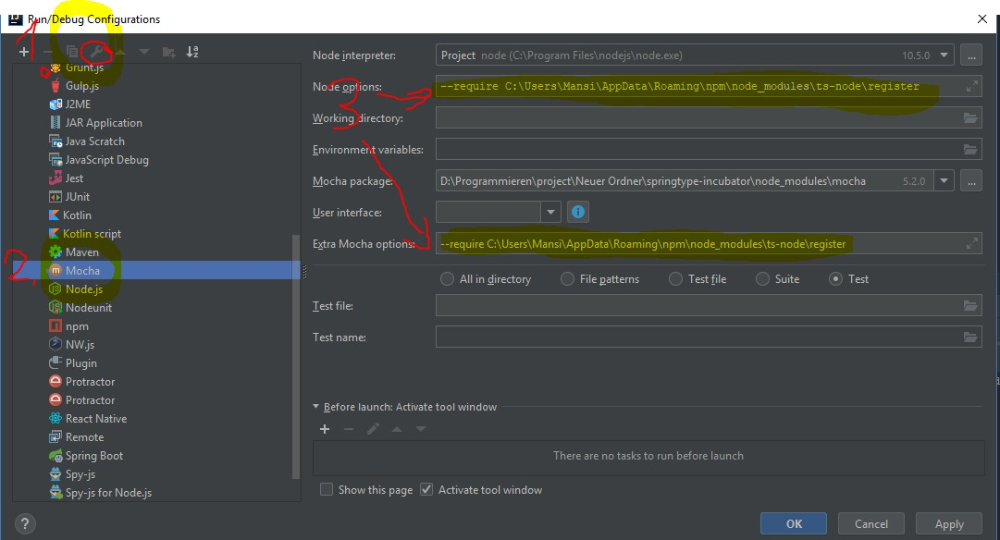

## TODO

Pre-beta-release TODO list:

- Modules:
  - webcomponent    
    - Improve performance for renderer
    - SSR/AOT: https://github.com/skatejs/skatejs/tree/master/packages/ssr
  - i18n
    - @Translate
    - @Locale
  - test
    - Fix mocha/chai based tests ("Set' only refers to a type, but is being used as a value here"?!)
    - Split tests
    - Write more tests
    - @Test and @TestSuite to be working
  - end-to-end-test
    - @EndToEndTestSuite and @EndToEndTest want to be working
    - Adapter for TestCafe
    - Write end-2-end tests for web components
  - example/minesweeper
    - Use model and state
  - state
    - Support for selectors: https://github.com/rematch/rematch/blob/master/plugins/select/README.md
    - Support for loading: https://github.com/rematch/rematch/blob/master/plugins/loading/README.md
    - Support for persist: https://github.com/rematch/rematch/blob/master/plugins/persist/README.md
    - Support for immer: https://github.com/rematch/rematch/blob/master/plugins/immer/README.md
      instead of _.deepClone(state)
    
- Write documentation for all modules (inline)
- Write a developer guide like facebook did with react-create-app
- Create beautiful next-gen SVG website using our own framework

- Write tests (70 to 90% goal)
  - First finish "test" module implementation
     
- How to deal with SSR (server side rendering) and AOT compiles?
- Implement meaningful examples and polish their architecture 
  - Examples:
    - Compatibility:
      - spring4react: How to use springtype burger-button web component in React
      - spring4angular: How to use springtype burger-button web component in Angular
      - spring4vue: How to use springtype burger-button web component in Vue.js
      - spring4jquery: How to use springtype burger-button web component with jQuery
      - spring4vanilla: How to use springtype burger-button web component in vanilla JS/HTML
      - react2springtype: How to use React Components (react-QRcode) in a springtype app
      - vue2springtype: How to use a Vue.js components in springtype
      - angular2springtype: How to use Angular components in springtype
      - jquery2springtype: How to use jQuery in springtype
      
    - Testing:
      - jest2springtype-app: App using Jest tests
      - mocha4springtype-app: App using Mocha tests
      - testcafe4springtype-app: App using Testcafe end-to-end tests
       
    - Styling
      - css2springtype-app: App using standard CSS
      - sass-materialize2springtype-app: App using materialize.css to show SASS styling 
      - sass-bootstrap2springtype-app: App using bootstrap 4 to show SASS styling
      - tss2springtype-app: App using TSS and dynamic theming
      - mixed-styles4springtype: App using CSS, SASS and TSS with themes
       
    - Real-world apps:
      - SVG TODO MVC PWA (Android, iOS, Web) with offline-first methodology (and firebase API, live demo page)
      - SVG Mineweeper game using gpu.js based matrices calc
      - Featured: SVG gantt-chart component (web-component, publicly available) 
       

# Usage
    npm i
    ts-node src/scratch/DependencyInjection.spec.ts
    
## Example Intellij    
### Executing test
    1. Add a new configuration for Mocha
    2. Add your Node Interpreter path to node module
    3. Add to Node options "--require C:\Users\CHANGE_ME\AppData\Roaming\npm\node_modules\ts-node\register"
    4. Select file pattern and enter this "src/**/*.spec.ts"
    

